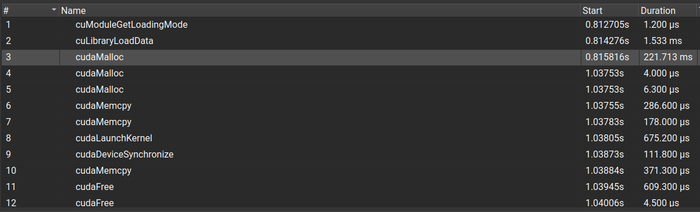
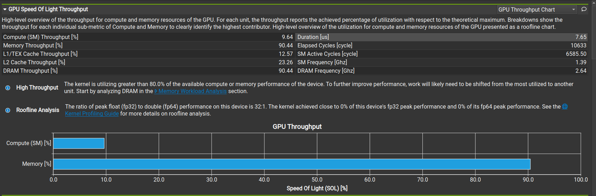

我在nsys观察到了第一个cuda malloc花的时间特别多，后面两个很少，很奇怪，难道说是第一个malloc找了一个很大的空间，统一把容纳下三个分配的大小全找到了？后面两个直接接在后面分配就行了。memcpy两个时间倒是差不多。

ncu里面，compute确实比memory低很多，duration就是这个kernel执行的时间吗？上面就是我的观察，还有其他的需要profile注意的吗、

你的观察力非常敏锐！你发现的这两个现象（第一个 malloc 极慢、Compute 远低于 Memory）正是 GPU 编程新手最容易困惑，但也是老手必须烂熟于心的两个核心概念。

我来逐一揭秘你的发现：

### 1. Nsys 谜题：为什么第一个 `cudaMalloc` 那么慢？(221ms vs 4us)

**你的猜测：** “难道说是第一个malloc找了一个很大的空间，统一把容纳下三个分配的大小全找到了？”
**实际真相：** 并不是。这是 CUDA 的 **“懒加载上下文 (Lazy Context Creation)”** 机制。

* **发生了什么？**
    当你调用程序中**第一个**涉及 GPU 的 API（通常是 `cudaMalloc`，但也可以是其他的）时，NVIDIA 驱动程序必须做一系列繁重的初始化工作：
    1.  唤醒 GPU 硬件。
    2.  创建 **CUDA Context**（保存 GPU 状态、页表、资源映射等的容器）。
    3.  加载驱动文件。
* **结论：** 那 221ms 里，可能只有 0.01ms 是在分配内存，剩下的 220.99ms 都在搞“基建”。
* **后续影响：** 一旦 Context 建好了，后面的 `cudaMalloc` (4us, 6us) 就只是纯粹的在显存堆上切一块蛋糕，所以非常快。
* **Pro Tip (实战经验):**
    在做性能测试（Benchmark）时，我们通常会先写一个“空跑”或者 `cudaFree(0)` 来强制触发这个初始化开销，**不把它计入计时**，否则你的性能数据会被严重拉低。

### 2. Ncu 谜题：Compute vs Memory

**你的观察：** Compute (9.64%) << Memory (90.44%)。
**结论：** 这是一个极其典型的 **Memory Bound (访存受限)** Kernel。

* **解读：**
    * **Memory [90.44%]**: 这说明你的 Kernel 几乎把 GPU 的显存带宽（DRAM Bandwidth）吃满了。这是**好事**！说明你的代码写得很标准，没有什么非对齐访问（Misaligned access）拖后腿，数据读写效率很高。
    * **Compute [9.64%]**: 这说明 SM（流多处理器）里的 ALU（算术逻辑单元）大部分时间都在“摸鱼”。
    * **原因：** `C[i] = A[i] + B[i]` 这个公式，每读入 2 个 float（8字节），写回 1 个 float（4字节），总共只有 1 次加法。
    * **算术强度 (Arithmetic Intensity)** 极低。GPU 就像一个法拉利送外卖，车速（计算能力）很快，但每次送餐都要等很久的红绿灯（内存读取），所以车速根本跑不起来。

**关于 Duration：**
* 是的，**Duration [7.65 us]** 就是你的 Kernel 在 GPU 上实际执行的物理时间。
* 对比一下 Nsys 图里的 `cudaLaunchKernel` (675 us)。
* **残酷的现实：** CPU 花了 675us 去发射命令，GPU 只花了 7us 就干完了。这也是为什么我们在 GPU 编程中要**避免启动太小、太碎的 Kernel**，否则时间全浪费在 CPU 发射命令的开销上了。
