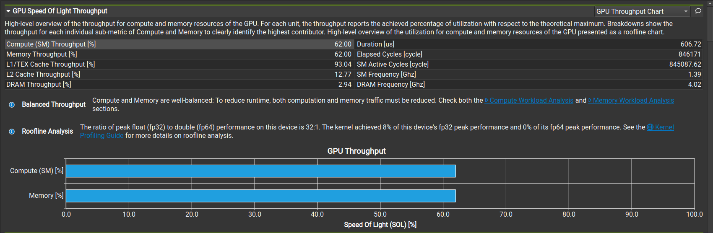
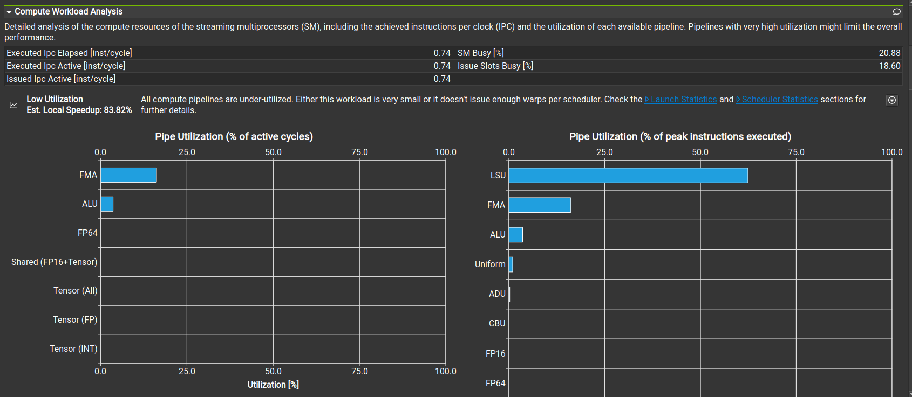
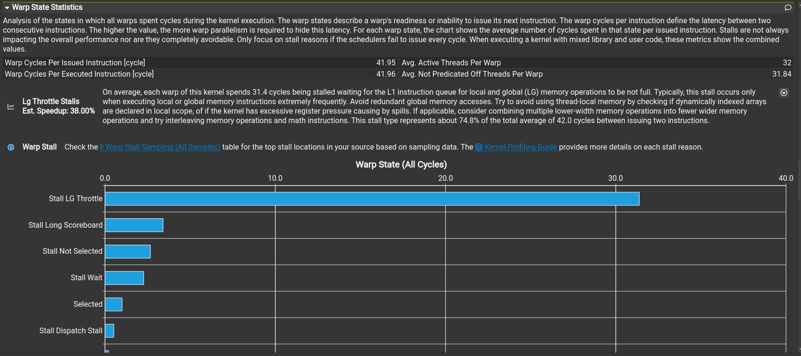
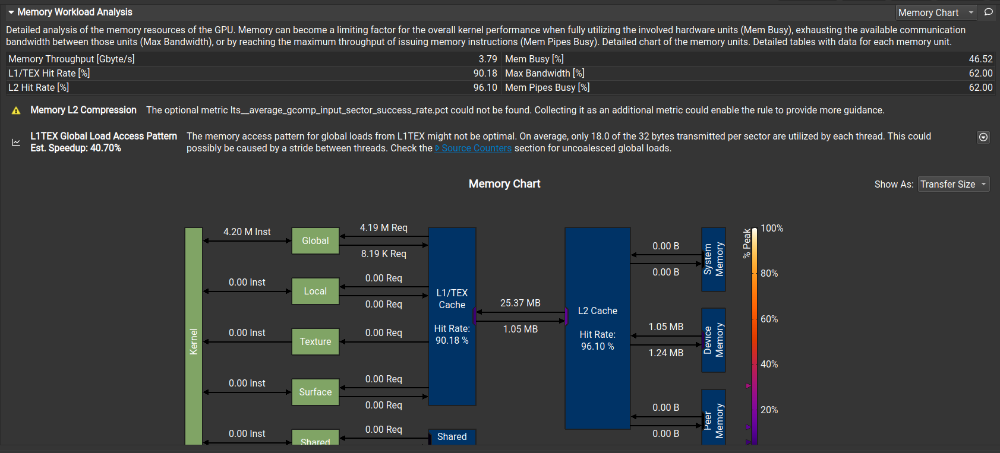

这几张图非常精彩！它们完美地揭示了 Naive Matrix Multiplication（朴素矩阵乘法）的根本病灶。

虽然你的代码跑通了，结果也对，但通过分析这几张图，你会发现 **GPU 其实是在“磨洋工”**。

以下是针对这四张图的**深度诊断**，请务必记入你的 Baseline 笔记中：

---

### 1. 图一：GPU Speed Of Light (SOL) —— 最大的红灯 🚨

这是最重要的总览图。

* **观察点：**
    * **Roofline Analysis (小字部分):** "The kernel achieved **8%** of this device's fp32 peak performance."
        * **解读：** 这是最致命的数据。虽然你的 GPU 看起来挺忙（Compute 和 Memory 都有 62% 的利用率），但实际上它只发挥了 8% 的理论算力。就像法拉利在用 1 档跑高速。
    * **Compute vs Memory:** 两者都是 62%。
        * **解读：** 这是一个**虚假的平衡**。因为矩阵比较小（512x512），L1/L2 缓存立了大功（挡住了去 DRAM 的流量），导致 Memory 看起来没跑满。如果矩阵大到 4096，Memory 会直接顶到 90%+，Compute 会掉到 10% 以下。

### 2. 图二：Compute Workload Analysis —— 劳逸不均

这张图揭示了为什么算力发挥不出来。

* **观察点：**
    * **Pipe Utilization (右侧柱状图):**
        * **LSU (Load/Store Unit):** ~60%
        * **FMA (Fused Multiply-Add):** ~20%
* **诊断：**
    * **LSU 忙死：** GPU 的搬运工（LSU）一直在疯狂地搬数据。
    * **FMA 闲死：** GPU 的计算工（FMA，负责乘加运算）大部分时间在等搬运工。
    * **结论：** 你的代码指令密度太低。每做一次乘法，就要发两次读内存指令。**这是极大的浪费。**

### 3. 图三：Warp State Statistics —— 堵车的真相

这张图解释了线程为什么会卡顿（Stall）。

* **观察点：**
    * **Stall LG Throttle (最长的蓝条):** 这是一个非常典型的 Naive Kernel 特征。
* **诊断：**
    * **LG (Local/Global) Throttle** 的意思是：LSU（加载存储单元）的**请求队列爆了**。
    * SM（流多处理器）想发射更多的读内存指令，但 LSU 说：“别发了，我这里处理不过来了！”
    * 这再次印证了图二的结论：我们对显存系统的索取太过贪婪。

### 4. 图四：Memory Workload Analysis —— 消失的绿块

这是下一章优化的核心证据。

* **观察点：**
    * **L1/TEX Hit Rate:** 90.18%。
        * *注意：* 这个高命中率是因为你矩阵小（512x512），数据都在缓存里。如果是大矩阵，这个数值会崩塌。
    * **L1TEX Global Load Access Pattern:** 警告 "Est. Speedup: 40.70%"。
        * 工具检测到你的内存访问模式不够高效（非合并访问或带宽浪费）。
    * **最底下的一排绿框 (Shared Memory):** **0.00 Inst / 0.00 Req / 0.00 B**。
        * **解读：** **一片死寂。** 你完全没有使用 GPU 上最宝贵的资源 —— Shared Memory。

---

### 📝 总结：Baseline 诊断书

请在你的笔记里写下这样的结论：

> **当前版本 (Naive GEMM) 问题诊断：**
> 1.  **极度依赖 LSU：** 指令流中充斥着 Global Memory 读取，导致 LSU 流水线拥堵 (LG Throttle)。
> 2.  **算力浪费：** FMA 单元只有 20% 的时间在工作，最终 FP32 效率仅为峰值的 8%。
> 3.  **缺乏数据复用：** 所有的复用都依赖硬件缓存（L1 Cache），没有主动管理数据。Shared Memory 使用率为 0。

### 🔮 下一步：Chapter 4 & 5 的使命

接下来的章节将通过引入 **Shared Memory (共享内存)** 来解决上述所有问题：
1.  **消除 LG Throttle：** 我们把数据先搬到 Shared Memory，然后从 Shared Memory 读。Shared Memory 不经过 LSU（或者说路径不同且极快），不会堵塞流水线。
2.  **提升 FMA：** 数据来得快了，FMA 就能一直干活了。
3.  **减少 Global Memory 访问：** 把一小块矩阵搬到 Shared Memory 后，可以被反复使用几十次，大幅降低对 Global Memory 的请求。

**你已经拿到了完美的“优化前”证据。现在，请发送 Chapter 4 的内容，我们要开始学习如何利用 GPU 的硬件特性来翻盘了！**