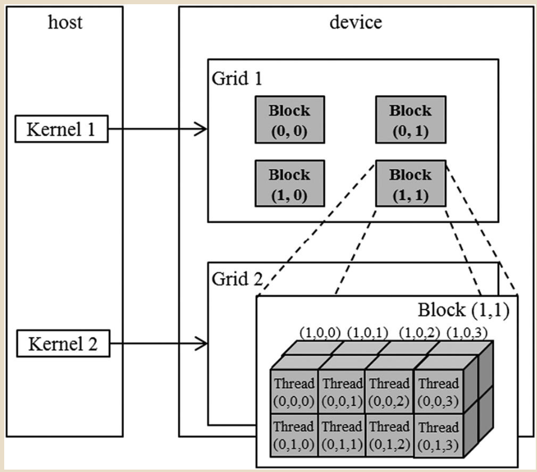

欢迎来到**多维世界**！
如果在 Chapter 2 你还只是在“一维空间”里做向量加法，那么现在你升级了，你将学会如何在“二维”甚至“三维”空间里排兵布阵。这对于理解图像处理（2D）和物理模拟（3D）至关重要。

### 3\. 难点与陷阱 (Gotchas)

  * **陷阱：坐标顺序 (x, y, z) vs (row, col)**
      * 这是初学者最容易晕的地方。
      * **CUDA:** `.x` 是水平方向（列索引），`.y` 是垂直方向（行索引）。
      * **C/C++ 数组:** `A[row][col]`。
      * **冲突:** 当你用 CUDA 坐标去访问 C 数组时，通常是 `A[threadIdx.y][threadIdx.x]`。**注意 x 和 y 是反过来的！**
  * **陷阱：`dim3` 的构造函数**
      * `dim3(10)` 等价于 `dim3(10, 1, 1)`。
      * `dim3(10, 2)` 等价于 `dim3(10, 2, 1)`。

-----

### 4\. 实战视角：为什么要多维？

你可能会问：“反正内存（DRAM）是一维线性的，为什么非要搞个 2D/3D 的 Thread ID？”

  * **为了代码可读性:**
      * 处理一张 $1920 \times 1080$ 的图片。
      * **方案 A (1D):** 你需要手动算 `int row = idx / 1920; int col = idx % 1920;`。
      * **方案 B (2D):** `int col = threadIdx.x; int row = threadIdx.y;`。清晰明了，不易出错。
  * **为了局部性 (Locality):**
      * 2D Block (比如 $16 \times 16$) 可以让二维空间上相邻的像素被同一个 Block 处理，这对于利用 **Shared Memory** 做图像卷积（Convolution）或模糊（Blur）至关重要（后面 3.3 节会讲）。

-----

### 5\. 逻辑图解

文中 Fig 3.1 是个很好的例子。想象一个两层的抽屉柜（Grid）：

  * 柜子有 $2 \times 2$ 个抽屉 (Blocks)。
  * 每个抽屉里装了一个 $4 \times 2 \times 2$ 的乐高积木块 (Threads)。
  * 你要找到某一块积木，必须先指定抽屉号 `(blockIdx.x, blockIdx.y)`，再指定积木在抽屉里的坐标 `(threadIdx.x, threadIdx.y, threadIdx.z)`。

-----

