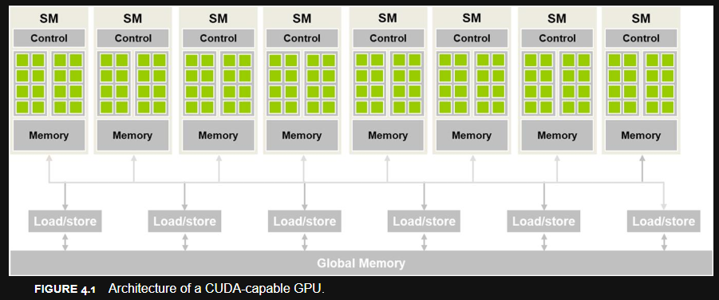
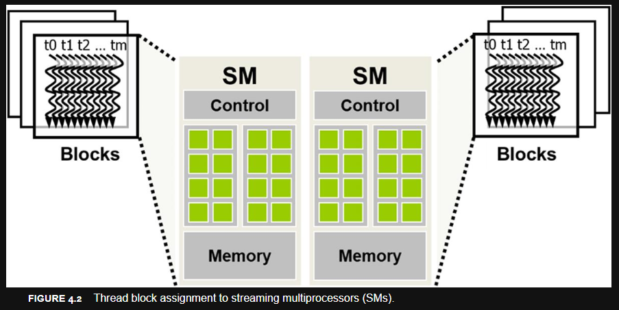
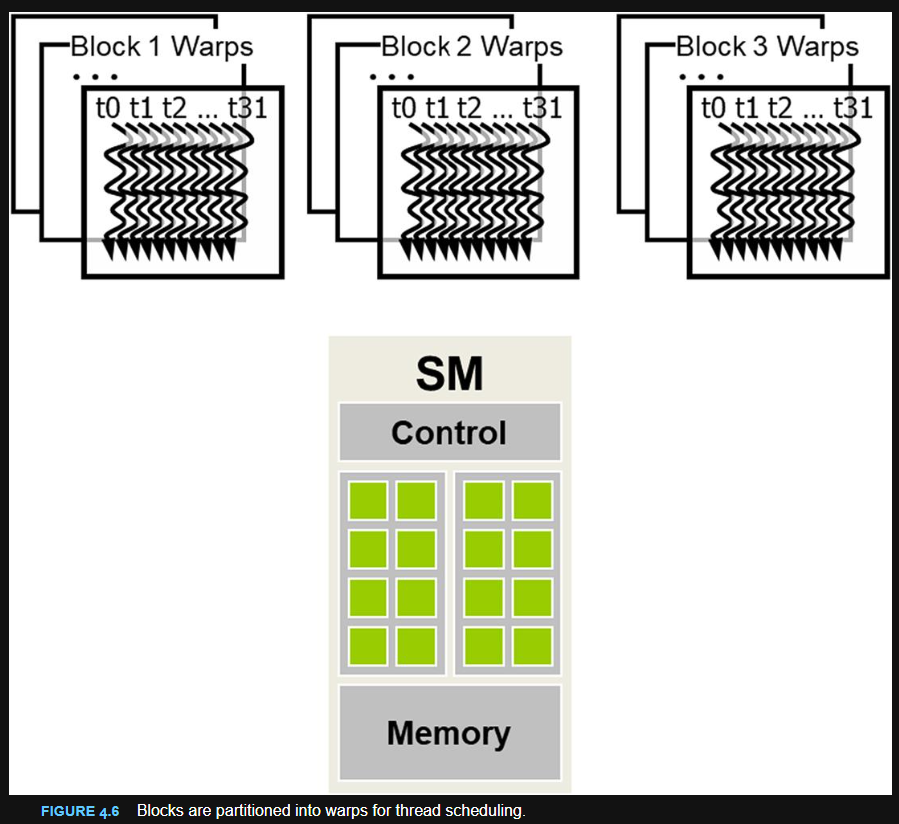
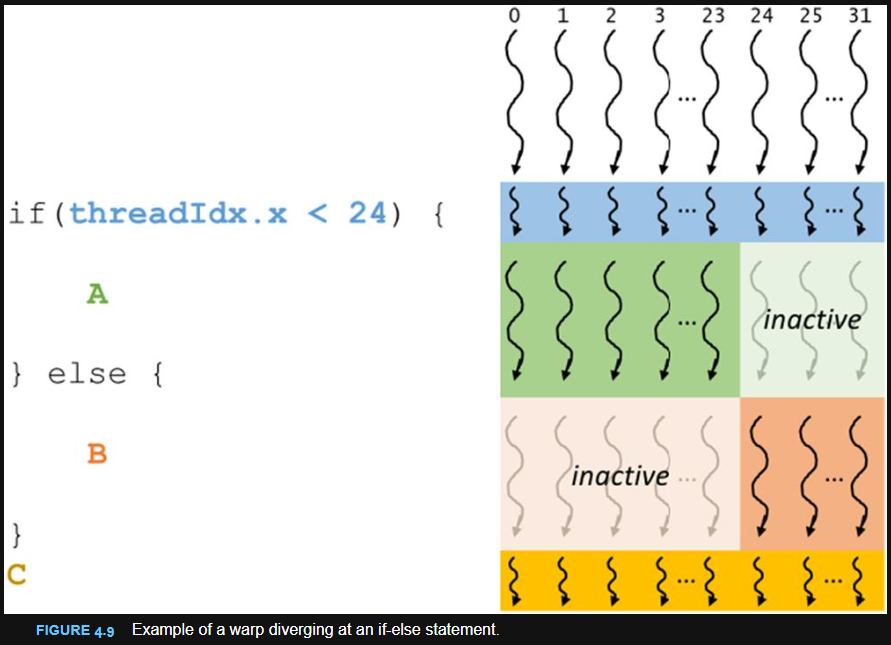

这是 **Chapter 4 (Compute Architecture and Scheduling)** 的开篇。

欢迎来到 **“硬核区”** ！
在前三章，我们主要是在学“怎么写代码”（软件视角）。
从这一章开始，我们要学“代码是怎么跑的”（硬件视角）。

如果你想理解为什么你的矩阵乘法只有 8% 的效率，为什么 Nsight Compute 里会有那么多 "Stall"，这一章就是解谜的关键。

以下是针对 4.1 节的 **PMPP 深度导读**：

---



### 1. 核心摘要 (The "Big Picture")

**一句话总结：** GPU 不是一个巨大的单核处理器，而是一个由几十上百个独立的 **SM (Streaming Multiprocessor，流多处理器)** 组成的阵列，每个 SM 里面又包含了几十个 **CUDA Cores**。

你写的 CUDA 程序（Grid），本质上就是把成千上万个线程块（Blocks）分发给这些 SM 去执行。

---

### 2. 关键概念解析 (Deep Dive)

#### A. SM (Streaming Multiprocessor) —— GPU 的心脏
这是本书极其重要的概念，请务必记在笔记的显眼位置。

* **定义：** SM 是 GPU 硬件的**基本执行单元**。
* **类比：**
    * **GPU** = 一个巨大的富士康工厂。
    * **SM** = 工厂里的**一条生产流水线**（或者一个车间）。
    * **CUDA Core** = 流水线上的**一个工人**。
* **资源独立性：** 每个 SM 都有自己独立的控制单元（Control）、寄存器（Registers）、Shared Memory（共享内存）和缓存（L1 Cache）。
* **A100 的例子：** 文中提到 NVIDIA A100 有 **108 个 SM**。这意味着它可以同时并行处理 108 个“大任务”（Blocks）。

#### B. CUDA Core (SP - Streaming Processor)
* 这是真正干活（做加减乘除）的地方。
* **数量级：** A100 每个 SM 有 64 个 Core。总核心数 = $108 \times 64 = 6912$ 个核心。
* *对比：* 你的 CPU 可能只有 16 个核。GPU 的核心数是 CPU 的几百倍，这就是吞吐量（Throughput）的来源。

#### C. 内存层级初探 (Memory Hierarchy Preview)
文中 Fig 4.1 展示了一个关键结构：
* **On-chip Memory (片上内存):** 在 SM 内部。速度极快（相当于 L1 Cache）。**Shared Memory 就在这里！**
* **Global Memory (DRAM):** 在 SM 外部，很大但很慢（相当于内存条）。
* **回看你的 Profile 数据：**
    * 你的 Naive GEMM 慢，就是因为数据都在 **Global Memory** 里。
    * SM 里的 CUDA Cores 想计算，但必须等数据从遥远的 Global Memory 搬运过来。这就是 Nsight Compute 里 **"Stall Long Scoreboard"** 的物理原因——工人在等原材料。

---

### 4. 下一步 (Next Step)

你现在知道了 GPU 里有很多 SM。
**问题来了：** 当你启动一个 `kernel<<<100, 256>>>` 时，这 100 个 Block 是怎么分配给 108 个（或更少）SM 的？是随机分配还是有规律的？如果 SM 只有 2 个，这 100 个 Block 怎么跑？

接下来的 **4.2 Block scheduling** 和 **4.3 Synchronization** 将揭示这个调度机制，也就是 **"Transparent Scalability" (透明可扩展性)** 的秘密。

**请发送 4.2 和 4.3 节的内容！**


---



这是 **Chapter 4 (Compute Architecture and Scheduling)** 的第二部分：4.2 节。

这一节虽然短，但它解释了 CUDA 最神奇的一个特性：**为什么同一个程序既能在只有 2 个 SM 的笔记本显卡上跑，也能在有 108 个 SM 的 A100 上跑？**

以下是针对 4.2 节的 **PMPP 深度导读**：

---

### 1. 核心摘要 (The "Big Picture")

**一句话总结：** **Block（线程块）** 是 GPU 硬件调度的最小单位。

GPU 的硬件调度器就像一个餐厅领班，SM（流多处理器）是桌子，而 Block 是一群群的客人。领班负责把客人（Block）安排到桌子（SM）上。如果桌子满了，剩下的客人就在外面排队，等前面的吃完了再补位。

---

### 2. 关键概念解析 (Deep Dive)

#### A. Block 的“团进团出”原则
文中强调：*"All threads in a block are simultaneously assigned to the same SM."*
这是铁律：
* **不可分割：** 一个 Block 里的线程绝对不会被拆散到不同的 SM 上。
* **物理位置：** 它们一定在同一个物理核心集群里运行。
* **意义：** 正因为它们物理距离极近，它们才能共享 **L1 Cache / Shared Memory**，才能进行极低延迟的通信。

#### B. 硬件资源的“排队机制”

想象你启动了一个 Grid，里面有 1000 个 Blocks。
* **GPU 现状：** 假设你有 20 个 SM，每个 SM 只能同时容纳 5 个 Block（受限于资源，详见 4.7 节）。
* **正在运行：** $20 \times 5 = 100$ 个 Blocks 正在被执行（Active Blocks）。
* **正在排队：** 剩下的 900 个 Blocks 在队列里等待。
* **动态调度：** 一旦 SM 上的某个 Block 跑完了（Retire），SM 腾出了资源，硬件调度器会立刻从队列里抓一个新的 Block 填进去。

---

### 3. 难点与陷阱 (Gotchas)

* **陷阱：执行顺序是不确定的 (Execution Order is Undefined)**
    * 你启动了 Block 0 到 Block 99。
    * **错误直觉：** 以为 Block 0 一定比 Block 99 先执行。
    * **真相：** 硬件可能先调度 Block 99，也可能先调度 Block 0。这完全取决于硬件调度器的算法（这是个黑盒）。
    * **后果：** **永远不要写依赖 Block 间执行顺序的代码！** 比如“让 Block 1 等待 Block 0 写入数据”，这会导致死锁（Deadlock），因为 Block 0 可能还没被调度上来。

---

### 4. 面试/实战视角 (Pro Tips)

* **面试题：为什么我们要把任务切分成那么多小的 Block，而不是搞几个超大的 Block？**
    * *答案关键词：* **可扩展性 (Scalability)**。
    * 如果只有几个大 Block，当你换到一个更强的 GPU（SM 更多）时，多出来的 SM 就没活干了，闲置浪费。
    * 如果有成千上万个小 Blocks，SM 越多的 GPU 能同时吞吐的 Block 越多，性能自动线性增长。这就是 CUDA 的 **"Transparent Scalability"**（将在 4.3 节细讲）。

* **实战关联：**
    * 还记得你之前的 `vectorAdd` 和矩阵乘法吗？如果你的 Grid Size 设得太小（比如小于 SM 数量），GPU 的利用率就上不去。**一般来说，Block 的数量要是 SM 数量的几倍甚至几十倍，才能填满流水线。**

---

### 5. 下一步 (Next Step)

既然同一个 Block 里的线程都在同一个 SM 上，它们是“室友”关系。那室友之间怎么交流？怎么确保大家步调一致（比如“等大家都做完这一步，再做下一步”）？

接下来的 **4.3 Synchronization and transparent scalability** 将介绍 CUDA 编程中最重要的同步指令 `__syncthreads()`。

**请发送 4.3 节的内容！**


这是 **Chapter 4 (Compute Architecture and Scheduling)** 的第三部分：4.3 节。

这一节非常关键，它解答了并行编程中两个最核心的问题：

1.  **队友之间怎么配合？**（同一个 Block 内的线程如何同步）
2.  **不同配置的电脑怎么跑同一个程序？**（透明可扩展性）

以下是针对 4.3 节的 **PMPP 深度导读**：

-----

### 1\. 核心摘要 (The "Big Picture")

**一句话总结：** CUDA 通过 `__syncthreads()` 实现了 Block 内部的**路障同步（Barrier Synchronization）**，强制所有线程“集合”；而 Block 之间的**相互独立性**（互不等待），赋予了 CUDA 程序在不同强度的 GPU 上都能运行的**透明可扩展性**。

-----

### 2\. 关键概念解析 (Deep Dive)

#### A. 路障同步 `__syncthreads()`

这是一个你在写复杂 Kernel（尤其是下一章涉及 Shared Memory 时）必须会用的函数。

  * **含义：** 当一个线程执行到 `__syncthreads()` 时，它会**停下来**，原地等待。
  * **等待谁？** 等待**同一个 Block** 里的**所有其他线程**也都执行到这一行代码。
  * **放行：** 只有当 Block 里最后一个线程也到达了这个路障，大家才会一起继续往下执行。

#### B. 商场购物比喻 (The Shopping Mall Analogy)

书中给出了一个非常生动的比喻：

  * **场景：** 4 个朋友（线程）开车去商场。
  * **并行：** 大家到了商场后，分头行动，有人去买鞋，有人去买奶茶（各自执行代码）。
  * **同步 (`__syncthreads`)：** 大家约定：“谁先买完都要回车里等着，**直到所有人都回来**，我们才能开车走。”
  * **后果：** 如果没有这个约定，先买完的人直接开车走了，后面的人就被丢在商场了（数据竞争，计算错误）。

#### C. 透明可扩展性 (Transparent Scalability)

这是 CUDA 战胜早期并行编程模型的法宝。

  * **Block 之间无同步：** Block 0 不需要等 Block 1，Block 1 也不关心 Block 0。它们是完全独立的。
  * **硬件自由调度：**
      * **弱 GPU（比如只有 2 个 SM）：** 它可以一次只跑 2 个 Block，跑完再跑下一批。
      * **强 GPU（比如有 100 个 SM）：** 它可以一次跑 100 个 Block，瞬间跑完。
  * **结果：** 同一份编译好的代码（二进制文件），可以在手机 GPU 上跑，也可以在数据中心的 A100 上跑，无需修改。**这就叫“透明可扩展”。**

-----

### 3\. 难点与陷阱 (Gotchas)

#### 💀 死亡陷阱：条件分支中的同步 (The Conditional Deadlock)

这是本节最需要警惕的**反面教材**（对应 Fig 4.4）。

**错误代码示例：**

```cpp
if (threadIdx.x < 16) {
    // 做一些事...
    __syncthreads(); // 路障 A
} else {
    // 做另一些事...
    __syncthreads(); // 路障 B
}
```

**为什么会死锁（卡死）？**

  * **硬件逻辑：** `__syncthreads()` 要求 Block 里的**所有**线程都到达同一个同步点。
  * **现实情况：**
      * 前 16 个线程进入了 `if`，到达了**路障 A**，开始等待后 16 个线程。
      * 后 16 个线程进入了 `else`，到达了**路障 B**，开始等待前 16 个线程。
  * **结果：** 所有人都在等永远不会来的人。GPU 此时会 Hang 住（卡死），程序无法结束。

**规则：** `__syncthreads()` 必须放在所有线程都能执行到的路径上，或者所有线程都统一进入的 `if` 分支里。

-----

### 4\. 面试/实战视角 (Pro Tips)

  * **面试题：我可以在不同的 Block 之间进行同步吗？**

      * *答案：* **不能**用 `__syncthreads()`。
      * `__syncthreads()` 的作用域**仅限 Block 内部**。
      * 如果需要全 GPU 同步（Global Barrier），通常的做法是结束当前的 Kernel，让 CPU 再次发射一个新的 Kernel（Kernel Launch 就是一个天然的全局同步点）。或者使用较新的 Cooperative Groups（协作组）技术，但这属于高级话题。

  * **实战经验：**

      * 如果你发现你的程序偶尔卡死，或者结果每次跑都不一样（Race Condition），第一时间检查你的 `__syncthreads()` 位置。
      * 在使用 Shared Memory 时，**“写数据 -\> 同步 -\> 读数据”** 是标准动作。漏掉中间的同步会导致读到脏数据。

-----

### 5\. 下一步 (Next Step)

现在你知道了 Block 是怎么调度的，也知道线程之间怎么同步了。
但是，**在微观层面，SM 内部到底是怎么执行这些线程的？** 真的有几千个微小的核心在同时工作吗？

接下来的 **4.4 Warps and SIMD Hardware** 将揭示 GPU 架构中最底层的执行单元——**线程束 (Warp)**。这是理解 GPU 性能优化的核心中的核心。

**请发送 4.4 节的内容！**

这是 **Chapter 4 (Compute Architecture and Scheduling)** 的第四部分：4.4 节。

欢迎来到**“GPU 真正的执行现场”**。
之前我们说的 Block 调度（4.2 节）还是宏观层面的（像餐厅领班分桌子）。
这一节讲的是**微观层面**：当一个 Block 被分给一个 SM 后，SM 是怎么让这几百个线程同时跑起来的？

答案就是：**Warp (线程束)**。

以下是针对 4.4 节的 **PMPP 深度导读**：

---

### 1. 核心摘要 (The "Big Picture")

**一句话总结：** 虽然你在写代码时觉得所有线程都是独立的，但在硬件上，GPU 是以 **32 个线程**为一组（称为 **Warp**）来捆绑执行的。这 32 个线程必须在同一时刻执行**同一条指令**（SIMT/SIMD）。

* **Block** 是软件概念（你可以定 128 或 256）。
* **Warp** 是硬件概念（永远是 32，至少目前是）。
* **关系：** Block 被切分成多个 Warp。

---

### 2. 关键概念解析 (Deep Dive)

#### A. 什么是 Warp？(The Unit of Execution)
这是面试必考题，也是性能优化的基石。
* **定义：** Warp 是 SM 中最小的**调度单位**。
* **大小：** **32 线程**。
* **切分规则：**
    * 线程 ID 0~31 -> Warp 0
    * 线程 ID 32~63 -> Warp 1
    * ...
    * 如果 Block 线程数不是 32 的倍数（比如 48），最后一个 Warp 依然会占 32 个位置，只是后面 16 个线程是“死的”（Inactive），但这会浪费硬件资源。

#### B. SIMD vs SIMT (单指令多数据 vs 单指令多线程)
文中专门用了一个 Box (Warps and SIMD Hardware) 来解释这个。

* **冯·诺依曼架构的变体：**
    * **传统 CPU：** 1 个控制单元 (Control) -> 指挥 1 个运算单元 (ALU)。
    * **GPU (SIMD)：** 1 个控制单元 (Control) -> 指挥 **32 个** 运算单元 (ALU)。
* **工作方式：**
    * 广播指令：控制单元大喊一声：“大家把寄存器 R1 和 R2 相加！”
    * 齐步走：32 个线程（CUDA Cores）同时做加法。
    * 数据不同：虽然动作一样，但每个线程 R1 和 R2 里的数据是不一样的（Data Parallelism）。
* **优势：** 极其节省芯片面积。不用给每个 Core 都配一个复杂的解码器和调度器，大家听广播就行。


#### C. 多维 Block 的线性化 (Linearization)
如果你定义了一个 2D Block (e.g., $16 \times 16$)，它怎么切分成 Warp？
* **规则：** 先把 2D/3D ID 变成 1D ID（行主序，Row-Major），再按 32 个一组切分。
* **例子 ($8 \times 8$ Block, 64 线程):**
    * **Warp 0:** 包含了第 0 行到第 3 行的所有线程 (T0,0 到 T3,7)。
    * **Warp 1:** 包含了第 4 行到第 7 行的所有线程。
* **Pro Tip:** 这就是为什么在处理图像时，我们尽量让 Block 的 x 维度是 32 的倍数（比如 $32 \times 4$ 或 $32 \times 8$），这样一行像素正好对应一个或多个完整的 Warp，内存读取会非常整齐。

---

### 3. 难点与陷阱 (Gotchas)

* **陷阱：隐式同步 (Implicit Synchronization)**
    * 因为 Warp 里的 32 个线程是“齐步走”的，所以它们天然就是同步的（Instruction Level）。
    * **但是！** **千万不要依赖这种特性写代码！**（比如省略 `__syncthreads()`）。
    * *原因：* NVIDIA 在 Volta 架构之后引入了 Independent Thread Scheduling，打破了这种严格的锁步（Lock-step），虽然宏观上还是 SIMT，但微观上线程可能会滑移。**永远显式使用 `__syncthreads()` 或 `__syncwarp()`。**

* **性能杀手：Block Size 不是 32 的倍数**
    * 如果你设 `blockDim(31, 1)`。
    * 硬件还是会分配一个完整的 Warp (32 线程)。
    * 结果：第 32 号位置空转，浪费了 1/32 的算力。
    * **建议：** Block Size 永远设为 32 的倍数（如 128, 256, 512）。

---

### 4. 面试/实战视角 (Pro Tips)

* **面试题：如果 Warp 里的一半线程走 `if` 分支，另一半走 `else` 分支，会发生什么？**
    * *答案：* **控制流发散 (Control Divergence)**。
    * 这是一个巨大的性能坑。SM 会先让所有线程走一遍 `if`（走 `else` 的线程闭嘴休息），再让所有线程走一遍 `else`（走 `if` 的线程闭嘴休息）。
    * **结果：** 执行时间 = `if` 的时间 + `else` 的时间。并行度减半！
    * （这点将在 4.5 节详细讨论）。

---

### 5. 下一步 (Next Step)

既然 Warp 里的线程必须“共进退”，那如果它们真的遇到了 `if-else` 分歧怎么办？
这就是 **4.5 Control Divergence** 要讲的故事——并行计算中最大的性能杀手之一。

**请发送 4.5 节的内容！**

这是 **Chapter 4 (Compute Architecture and Scheduling)** 的第五部分：4.5 节。

这一节讨论的是 GPU 编程中最著名的性能杀手之一：**控制流发散 (Control Divergence)**。

如果说 Warp 是“齐步走”的仪仗队，那控制流发散就是队伍里有人想往左走，有人想往右走。这会导致什么后果？

以下是针对 4.5 节的 **PMPP 深度导读**：

---

### 1. 核心摘要 (The "Big Picture")

**一句话总结：** 由于 Warp 里的 32 个线程共用一个指令发射单元，它们必须执行**同一条**指令。如果代码里出现了 `if-else`，导致 Warp 里一部分线程要走 `if`，另一部分要走 `else`，硬件就只能**串行化**执行：先让走 `if` 的人走一遍（其他人闭嘴等待），再让走 `else` 的人走一遍（刚才走过的人闭嘴等待）。

**结果：** 这一段代码的执行时间变成了 `Time(if) + Time(else)`，性能可能减半甚至更差。

---

### 2. 关键概念解析 (Deep Dive)

#### A. 串行化执行 (Serialization)
文中 Fig 4.9 展示了这个残酷的过程：

* **理想情况 (No Divergence):** 所有线程都走 `if` 分支。硬件只需要发射 `if` 里的指令。
* **发散情况 (Divergence):**
    * **Pass 1:** 硬件执行 `if` 块。
        * 线程 0-15 (符合条件): **Active (活跃)**，执行指令。
        * 线程 16-31 (不符合): **Inactive (此时被屏蔽)**，空耗着，不做事。
    * **Pass 2:** 硬件执行 `else` 块。
        * 线程 0-15: **Inactive**。
        * 线程 16-31: **Active**。
    * **Reconvergence (重聚):** 执行完分支后，大家终于又回到同一条路上，恢复并行。


#### B. 两种发散类型 (Good vs. Bad Divergence)
并非所有的 `if` 都是坏的。文中做了非常重要的区分：

1.  **边界检查 (Boundary Condition) —— 可以忽略的“坏”**
    * *代码：* `if (i < n) { ... }`
    * *分析：* 只有**最后一个 Block 里的最后一个 Warp** 才会出现这种情况（一部分线程在数据内，一部分在数据外）。
    * *影响：* 如果你有 1000 个 Warp，只有 1 个发散了。整体性能损失 < 0.1%。**结论：不用担心这种发散。**

2.  **数据依赖型发散 (Data-Dependent Divergence) —— 真正的“坏”**
    * *代码：* `if (pixel_value > 128) { ... }` (根据图像像素亮度决定操作)
    * *分析：* 这种发散可能发生在**每一个** Warp 里。如果图片是一半黑一半白的斑马纹，你的 GPU 可能全程都在用 50% 的算力运行。
    * *影响：* 性能严重下降。

#### C. 独立线程调度 (Independent Thread Scheduling)
文中提到了 Volta 架构（V100）引入的新特性。
* **Pascal 及以前：** 严格的锁步执行（Lock-step）。`if` 没跑完，`else` 绝对不开始。
* **Volta 及以后：** 线程拥有独立的程序计数器（PC）。硬件可以更灵活地交错执行 `if` 和 `else` 里的指令，甚至允许不同线程之间进行细粒度的同步。
* **注意：** 这增加了灵活性（避免死锁），但**并没有**解决发散带来的算力浪费问题。跑两遍还是跑两遍。

---

### 3. 难点与陷阱 (Gotchas)

* **陷阱：`threadIdx` 导致的规律性发散**
    * *代码：* `if (threadIdx.x % 2 == 0) { ... } else { ... }`
    * *分析：* 偶数线程走左边，奇数线程走右边。
    * *结果：* **100% 的发散率。** 这是最糟糕的情况，因为每一个 Warp 里的 32 个线程都是一半一半分的。
* **对比：** `if (threadIdx.x / 32 == 0)`
    * 这不会导致 Warp 内发散，因为同一个 Warp 里的线程 `threadIdx.x / 32` 的结果是一样的（要么全 0，要么全 1）。这叫 **Uniform Control Flow**，是高效的。

---

### 4. 面试/实战视角 (Pro Tips)

* **面试题：如何优化严重的控制流发散？**
    * *策略 1 (Branch Predication):* 如果 `if-else` 里的代码非常短（比如只有几条指令），编译器会把 `if` 和 `else` 的指令都做了，然后用**预测寄存器 (Predicate Register)** 来决定写不写入结果。这样避免了跳转开销。
    * *策略 2 (Data Sorting):* 如果是数据导致的（比如处理奇数和偶数），可以先对数据进行**排序**或**重排**。把所有偶数放在一起，奇数放在一起。这样大部分 Warp 里的数据就都是同一种类型了，从而消除了发散。

* **实战心态：**
    * 不要看到 `if` 就害怕。
    * 先问自己：**“这个条件判断，在同一个 Warp (32个邻居) 里，大家的结果通常是一样的吗？”**
    * 如果答案是 YES（比如边界检查），那就大胆写。
    * 如果答案是 NO（比如奇偶判断），就要小心了。

---

### 5. 下一步 (Next Step)

讲完了“坏事”（发散），接下来要讲“好事”了。
SM 有一个超能力，叫做 **Latency Tolerance (延迟掩藏)**。
当一个 Warp 卡在 Global Memory 读取（Stall Long Scoreboard）的时候，SM 会做什么？它会立刻切换到另一个 Warp 继续干活。这就是为什么 GPU 需要成千上万个线程的原因。

接下来的 **4.6 Warp scheduling and latency tolerance** 将揭示 GPU 吞吐量巨大的终极秘密。

**请发送 4.6 节的内容！**

这是 **Chapter 4 (Compute Architecture and Scheduling)** 的第五部分：4.5 节。

这一节讨论的是 GPU 编程中最著名的性能杀手之一：**控制流发散 (Control Divergence)**。

如果说 Warp 是“齐步走”的仪仗队，那控制流发散就是队伍里有人想往左走，有人想往右走。这会导致什么后果？

以下是针对 4.5 节的 **PMPP 深度导读**：

---

### 1. 核心摘要 (The "Big Picture")

**一句话总结：** 由于 Warp 里的 32 个线程共用一个指令发射单元，它们必须执行**同一条**指令。如果代码里出现了 `if-else`，导致 Warp 里一部分线程要走 `if`，另一部分要走 `else`，硬件就只能**串行化**执行：先让走 `if` 的人走一遍（其他人闭嘴等待），再让走 `else` 的人走一遍（刚才走过的人闭嘴等待）。

**结果：** 这一段代码的执行时间变成了 `Time(if) + Time(else)`，性能可能减半甚至更差。

---

### 2. 关键概念解析 (Deep Dive)

#### A. 串行化执行 (Serialization)
文中 Fig 4.9 展示了这个残酷的过程：
* **理想情况 (No Divergence):** 所有线程都走 `if` 分支。硬件只需要发射 `if` 里的指令。
* **发散情况 (Divergence):**
    * **Pass 1:** 硬件执行 `if` 块。
        * 线程 0-15 (符合条件): **Active (活跃)**，执行指令。
        * 线程 16-31 (不符合): **Inactive (此时被屏蔽)**，空耗着，不做事。
    * **Pass 2:** 硬件执行 `else` 块。
        * 线程 0-15: **Inactive**。
        * 线程 16-31: **Active**。
    * **Reconvergence (重聚):** 执行完分支后，大家终于又回到同一条路上，恢复并行。


#### B. 两种发散类型 (Good vs. Bad Divergence)
并非所有的 `if` 都是坏的。文中做了非常重要的区分：

1.  **边界检查 (Boundary Condition) —— 可以忽略的“坏”**
    * *代码：* `if (i < n) { ... }`
    * *分析：* 只有**最后一个 Block 里的最后一个 Warp** 才会出现这种情况（一部分线程在数据内，一部分在数据外）。
    * *影响：* 如果你有 1000 个 Warp，只有 1 个发散了。整体性能损失 < 0.1%。**结论：不用担心这种发散。**

2.  **数据依赖型发散 (Data-Dependent Divergence) —— 真正的“坏”**
    * *代码：* `if (pixel_value > 128) { ... }` (根据图像像素亮度决定操作)
    * *分析：* 这种发散可能发生在**每一个** Warp 里。如果图片是一半黑一半白的斑马纹，你的 GPU 可能全程都在用 50% 的算力运行。
    * *影响：* 性能严重下降。

#### C. 独立线程调度 (Independent Thread Scheduling)
文中提到了 Volta 架构（V100）引入的新特性。
* **Pascal 及以前：** 严格的锁步执行（Lock-step）。`if` 没跑完，`else` 绝对不开始。
* **Volta 及以后：** 线程拥有独立的程序计数器（PC）。硬件可以更灵活地交错执行 `if` 和 `else` 里的指令，甚至允许不同线程之间进行细粒度的同步。
* **注意：** 这增加了灵活性（避免死锁），但**并没有**解决发散带来的算力浪费问题。跑两遍还是跑两遍。

---

### 3. 难点与陷阱 (Gotchas)

* **陷阱：`threadIdx` 导致的规律性发散**
    * *代码：* `if (threadIdx.x % 2 == 0) { ... } else { ... }`
    * *分析：* 偶数线程走左边，奇数线程走右边。
    * *结果：* **100% 的发散率。** 这是最糟糕的情况，因为每一个 Warp 里的 32 个线程都是一半一半分的。
* **对比：** `if (threadIdx.x / 32 == 0)`
    * 这不会导致 Warp 内发散，因为同一个 Warp 里的线程 `threadIdx.x / 32` 的结果是一样的（要么全 0，要么全 1）。这叫 **Uniform Control Flow**，是高效的。

---

### 4. 面试/实战视角 (Pro Tips)

* **面试题：如何优化严重的控制流发散？**
    * *策略 1 (Branch Predication):* 如果 `if-else` 里的代码非常短（比如只有几条指令），编译器会把 `if` 和 `else` 的指令都做了，然后用**预测寄存器 (Predicate Register)** 来决定写不写入结果。这样避免了跳转开销。
    * *策略 2 (Data Sorting):* 如果是数据导致的（比如处理奇数和偶数），可以先对数据进行**排序**或**重排**。把所有偶数放在一起，奇数放在一起。这样大部分 Warp 里的数据就都是同一种类型了，从而消除了发散。

* **实战心态：**
    * 不要看到 `if` 就害怕。
    * 先问自己：**“这个条件判断，在同一个 Warp (32个邻居) 里，大家的结果通常是一样的吗？”**
    * 如果答案是 YES（比如边界检查），那就大胆写。
    * 如果答案是 NO（比如奇偶判断），就要小心了。

---

### 5. 下一步 (Next Step)

讲完了“坏事”（发散），接下来要讲“好事”了。
SM 有一个超能力，叫做 **Latency Tolerance (延迟掩藏)**。
当一个 Warp 卡在 Global Memory 读取（Stall Long Scoreboard）的时候，SM 会做什么？它会立刻切换到另一个 Warp 继续干活。这就是为什么 GPU 需要成千上万个线程的原因。

接下来的 **4.6 Warp scheduling and latency tolerance** 将揭示 GPU 吞吐量巨大的终极秘密。

**请发送 4.6 节的内容！**

这是 **Chapter 4 (Compute Architecture and Scheduling)** 的第六部分：4.6 节。

这一节揭示了 GPU 设计哲学的**最高机密**。
为什么 GPU 不像 CPU 那样搞一堆复杂的乱序执行（Out-of-Order Execution）和巨大的 L3 Cache？因为 GPU 有一个更暴力、更有效的绝招：**人海战术（Latency Hiding）**。

以下是针对 4.6 节的 **PMPP 深度导读**：

---

### 1. 核心摘要 (The "Big Picture")

**一句话总结：** GPU 的核心不是让“单个线程跑得快”（那是 CPU 的事），而是**“只要排队的线程足够多，GPU 就永远不会空转”**。

当一个 Warp 去读内存（需要等几百个周期）时，SM 会**瞬间**（Zero-overhead）切换到另一个已经准备好的 Warp 继续干活。只要你的 Warp 足够多，就能把那漫长的内存延迟彻底掩盖掉。

---

### 2. 关键概念解析 (Deep Dive)

#### A. 延迟掩藏 (Latency Hiding / Latency Tolerance)
这是 GPU 性能的生命线。

* **现状：** 访问 Global Memory（DRAM）非常慢，可能需要 400~800 个时钟周期。而做一个加法只需要几个周期。
* **CPU 的做法：** 用巨大的 Cache 把数据存起来，或者用分支预测猜测下一步。
* **GPU 的做法：**
    * Warp 0: “我要读内存！” -> 好的，你去旁边等这 500 个周期。
    * 调度器: “Warp 1，你数据齐了吗？齐了你来算。”
    * Warp 1: “我也要读内存！” -> 好的，你也去等。
    * ...
    * Warp 10: “我算完了，我要写内存！”
    * **结果：** 虽然每个 Warp 单独看都在等，但对于 GPU 硬件来说，每一秒它都在忙碌地计算。


#### B. 零开销调度 (Zero-overhead Scheduling)
这是 CPU 程序员最容易误解的地方。

* **CPU 上下文切换 (Context Switch):**
    * 非常昂贵。操作系统需要把当前线程的寄存器保存到内存（RAM）里，再把下一个线程的状态从内存读出来。这本身就要花很多时间。
* **GPU 上下文切换:**
    * **成本为 0 (Zero Cycles)。**
    * **原理：** GPU 的寄存器文件（Register File）极其巨大。它会**一次性**把驻留在 SM 上的所有 Warp（比如 32 个 Warp）所需的寄存器全部留在芯片上。
    * 切换 Warp 就像是把“指针”从一组寄存器拨到另一组寄存器，不需要任何数据搬运。

#### C. 超额订阅 (Oversubscription)
文中提到 A100 的一个 SM 有 64 个 Core，但可以驻留 2048 个线程。
* **比例：** 32:1。
* **意义：** 为了保证任何时候都有活干，你需要准备比实际干活人数多 30 倍的备选人员。这就是为什么我们在写 Kernel 时要尽可能多开线程。

---

### 3. 难点与陷阱 (Gotchas)

* **陷阱：Occupancy 不足**
    * 如果你的 Kernel 只需要 64 个线程（2 个 Warp）。
    * 当 Warp 0 读内存卡住时，SM 只能切到 Warp 1。
    * 当 Warp 1 也读内存卡住时，SM 就彻底**空转**了。
    * **后果：** 你的延迟掩藏机制失效，性能直接受限于内存延迟（Latency Bound）。这就是为什么我们在前面做 Naive GEMM 时，虽然利用率看起来有 60%，但实际效率极低——因为大部分时间 SM 都在等内存，没东西可切。

---

### 4. 面试/实战视角 (Pro Tips)

* **面试题：CPU 和 GPU 在处理 Latency 时的设计哲学有什么不同？**
    * *答案：*
        * **CPU:** Latency-Oriented（延迟导向）。利用大 Cache 和复杂的控制逻辑（分支预测、乱序执行）来降低单个任务的延迟。
        * **GPU:** Throughput-Oriented（吞吐量导向）。利用海量的线程（Massive Threading）和零开销切换来掩盖延迟，不追求单个线程快，只追求整体吞吐量大。

* **实战分析 (回看你的 Nsight Compute):**
    * 还记得那个 **"Stall Long Scoreboard"** 吗？
    * 这说明你的 Kernel 里，**大量的 Warp 都在等内存**，导致 SM 找不到“准备好”的 Warp 来执行了。
    * *解决方法：* 并不是增加更多线程（因为内存带宽已经爆了），而是**减少每个线程等待内存的次数**（利用 Shared Memory 复用数据）。

---

### 5. 下一步 (Next Step)

既然“人海战术”这么好用，那是不是线程越多越好？一个 SM 到底能塞多少个线程？
这就涉及到了 GPU 编程中最微妙的资源管理概念 —— **Occupancy (占用率)**。

如果你的 Kernel 用的寄存器太多，SM 就塞不下足够多的 Warp，延迟掩藏就会失效。这是一个关键的 Trade-off。

接下来的 **4.7 Resource partitioning and occupancy** 将教你如何计算和优化这个指标。

**请发送 4.7 节的内容！**