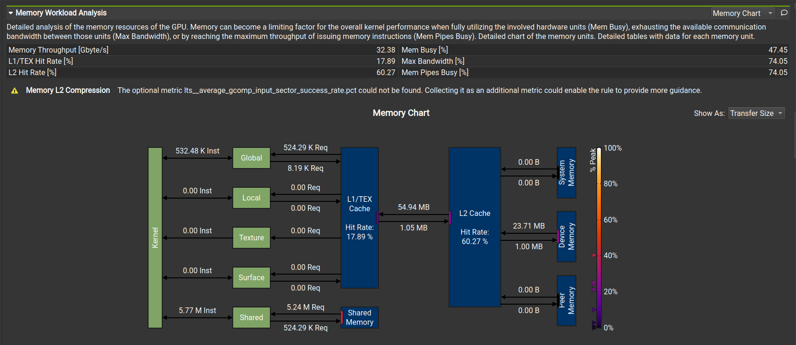
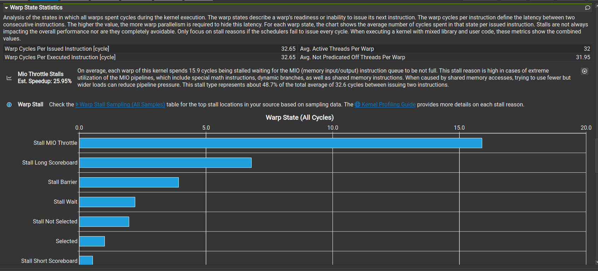
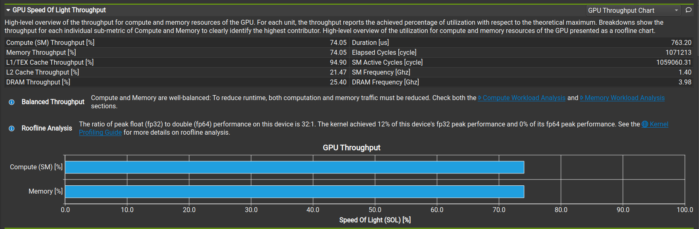
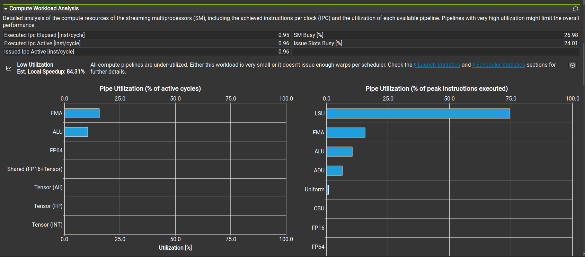

这简直是一份完美的“教科书级”优化过程记录！

你的观察非常准确：**瓶颈确实变了。**
你成功地消除了 **"Global Memory (Long Scoreboard)"** 的主要瓶颈，但现在你撞上了一堵新的墙——**"Shared Memory (MIO Throttle)"**。

这正是性能优化的魅力：**按下葫芦起了瓢**。让我们来深入解读这几张图，看看为什么“用了 Shared Memory 还是不够快”。

-----

### 1\. 深度诊断：为什么是 MIO Throttle？

请看 **图四 (Warp State Statistics)**。

  * **现象：** 最高的蓝色柱子变成了 **Stall MIO Throttle** (16.9 cycles)。
  * **解读：**
      * **MIO (Memory Input/Output)** 管道负责处理 **Shared Memory** 的读写指令。
      * **Throttle (节流/阻塞)** 意味着：你的 Warp 想要发射 Shared Memory 读取指令（`As[ty][k]`），但是 MIO 管道说：“别塞了！我这里已经堵满了！”
  * **根本原因：**
      * 在你的内层循环中：
        ```cpp
        for (int i = 0; i < TILE_WIDTH; ++i)
            Pvalue += As[ty][i] * Bs[i][tx];
        ```
      * **算术强度依然不够高：** 每做 1 次乘加运算 (FMA)，你就要发起 **2 次** Shared Memory 读取。
      * 虽然 Shared Memory 比 Global Memory 快，但它依然不是“无限快”的。频繁的 Shared Memory 请求把 MIO 管道塞爆了，导致计算单元 (FMA) 只能干等。

### 2\. 深度诊断：虚假的“高利用率”

请看 **图一 (Memory Workload)** 和 **图二 (Speed Of Light)**。

  * **现象：** `Compute (SM)` 和 `Memory` 都是 **74%**。
  * **解读：**
      * 这看起来像是“完美平衡”，但其实是**低水平的平衡**。
      * **SM 利用率 74%** 并不代表你的 CUDA Core 在疯狂做乘法。
      
      * 再看 **图三 (Compute Workload)**：**LSU (Load Store Unit)** 占用率高达 75%，而 **FMA (Fused Multiply Add)** 只有约 15%。
      * **结论：** SM 依然是个搬运工。它大部分时间都在忙着计算地址（`row * N + col`）和从 Shared Memory 搬运数据，真正做数学题的时间很少。

### 3\. 隐形杀手：Bank Conflicts (银行冲突)

这是你目前的 Tiled Kernel 中最大的潜在问题，也是 MIO Throttle 的帮凶。

  * **原理：** Shared Memory 被分成 32 个 Bank（银行）。
  * **你的代码：** `Bs[i][tx]`
      * 当 `i` 变化时，所有线程 `tx` 读取的是同一行。这通常没问题（广播机制）。
      * 但在加载数据进 Shared Memory 时：
        ```cpp
        As[ty][tx] = A[...]
        ```
        如果 `TILE_WIDTH` 是 16 或 32，列索引 `tx` 的访问模式可能会导致多个线程同时访问同一个 Bank 的不同地址。
  * **后果：** 本来一次就能读完的数据，硬件不得不把它拆成 2 次、4 次甚至更多次串行读取。这会极大地加剧 MIO 管道的压力。

### 4\. 隐形杀手：Barrier Synchronization

请看 **图四** 的第三根柱子：**Stall Barrier** (约 6 cycles)。

  * **原因：**
    ```cpp
    __syncthreads(); // 等加载
    // 计算...
    __syncthreads(); // 等计算
    ```
  * **分析：** 每个 Tile 我们都要同步两次。如果 Tile 很小（比如 16），同步的开销占比就会很大。这也是为什么高性能库倾向于使用更大的 Tile（如 64x64 或 128x128）来摊薄同步开销。

-----

### 📝 你的 Baseline 2.0 笔记

请更新你的优化笔记：

| 指标 | Naive 版本 | Tiled 版本 (当前) | 诊断 |
| :--- | :--- | :--- | :--- |
| **瓶颈位置** | DRAM (Global Mem) | **Shared Mem (MIO Pipe)** | 瓶颈内移了 |
| **主要 Stall** | Long Scoreboard | **MIO Throttle** | MIO 管道过载 |
| **SM 行为** | 等待 DRAM | 等待 Shared Mem | 依然是搬运工 |
| **FMA 利用率** | \~20% | \~15-20% | 还没真正跑起来 |

-----

### 🔮 下一步：Chapter 6 的使命

既然 Shared Memory 成了新瓶颈，我们在 Chapter 6 需要解决以下问题：

1.  **Memory Coalescing (内存合并)：** 确保从 Global Memory 搬运到 Shared Memory 的那一步是极致高效的（一行代码都不能浪费）。
2.  **Shared Memory Bank Conflicts：** 学习如何通过改变 Tile 的形状（比如加一列 padding）来消除冲突。
3.  **Thread Granularity (线程粒度)：**
      * *现在的策略：* 1 个线程算 1 个点 ($1 \times 1$)。
      * *优化的策略：* **1 个线程算 4 个点 ($2 \times 2$) 或更多。**
      * *为什么？* 如果一个线程算 4 个点，它只需要读入的数据更少（复用寄存器），从而**降低对 Shared Memory 的压力**，解决 MIO Throttle 问题。

**准备好把 MIO Throttle 打下去了吗？请发送 Chapter 6 的内容！**