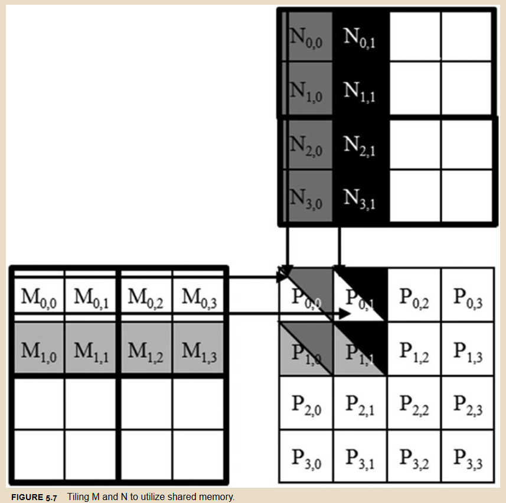
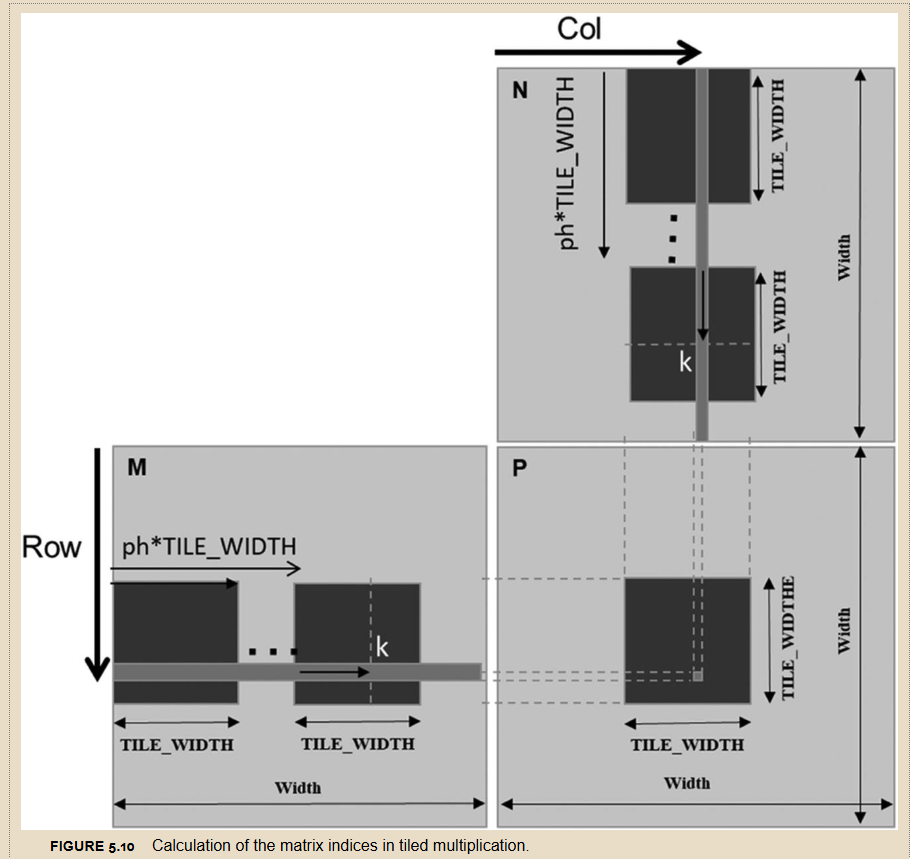
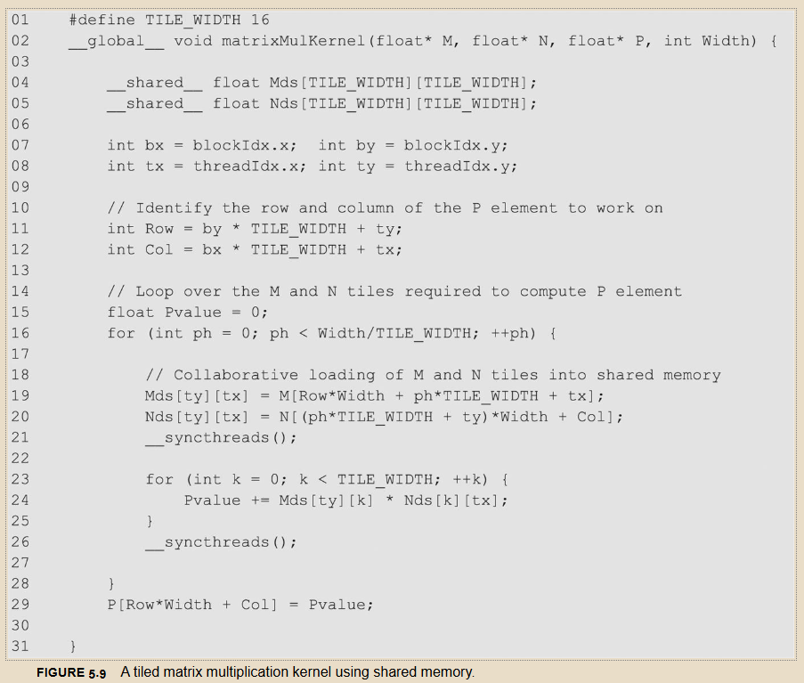

这是 **Chapter 5 (Memory Architecture and Data Locality)** 的第三部分：5.3 节。

这一节是整个 CUDA 编程课程中**最经典、最震撼**的时刻。你即将学会一种把 Global Memory 流量降低几十倍的魔法——**Tiling (分块技术)**。

如果说 Shared Memory 是武器，那么 Tiling 就是使用这把武器的**绝世剑法**。

以下是针对 5.3 节的 **PMPP 深度导读**：

---

### 1. 核心摘要 (The "Big Picture")

**一句话总结：** 为了解决 Global Memory 慢的问题，我们不再让每个线程单独去 DRAM 取数，而是让**一个 Block 的所有线程合作**，把一大块数据（Tile）搬运到 **Shared Memory**（相当于在 SM 内部建了一个临时仓库），然后大家对着这个仓库反复读取，直到榨干它的价值，再搬下一块。

---

### 2. 关键概念解析 (Deep Dive)

#### A. 痛点：冗余访问 (Redundant Access)
在 Naive 矩阵乘法中：
* 线程 (0,0) 要读 A 的第 0 行。
* 线程 (0,1) 也要读 A 的第 0 行。
* ...
* 线程 (0, 15) 都要读 A 的第 0 行。

虽然大家读的是同一行数据，但在 Naive 模式下，每个线程都独自去 Global Memory 发起请求。**A 的第 0 行被重复读取了 N 次！** 这就是为什么你的 `ncu` 报告里 DRAM 带宽爆满的原因。



#### B. 核心策略：Tiling (分块/贴瓷砖)
**Tiling** 的核心思想是**“团购”**：
1.  **分阶段 (Phased Execution):** 我们不再一次性算完整个点积，而是把长长的向量切成一小段一小段（Tile）来算。
2.  **协作加载 (Collaborative Loading):**
    * 大家停下手中的计算。
    * 每个线程负责从 Global Memory 搬运 **1 个** 元素到 Shared Memory。
    * **瞬间**，Shared Memory 里就有了当前计算所需的 $16 \times 16$ 的 A 子块和 B 子块。
3.  **高速计算:**
    * 所有线程从 Shared Memory（极速）读取数据进行计算。
    * 虽然还要读很多次，但这次读的是 Cache，不消耗 DRAM 带宽。

#### C. 执行流程 (The Execution Flow)
这是一个循环过程，直到算完所有数据：

1.  **Phase 0:**
    * 搬运 A 的第 0 个 Tile 和 B 的第 0 个 Tile 进 Shared Mem。
    * `__syncthreads()` (等大家搬完)。
    * 在 Shared Mem 上做乘法累加。
    * `__syncthreads()` (等大家算完，防止有人把 Shared Mem 覆盖了)。
2.  **Phase 1:**
    * 搬运 A 的第 1 个 Tile 和 B 的第 1 个 Tile...
    * ...
3.  **Phase K:** ...


---

### 3. 数学证明：为什么要这么做？

文中给出了一个极其诱人的公式：

* **Global Memory 流量减少比例 = 1 / TILE_WIDTH**

如果你使用 $16 \times 16$ 的 Block（即 TILE_WIDTH = 16）：
* **流量减少到原来的 1/16。**
* 换句话说，你的**等效带宽扩大了 16 倍**！
* 如果你用 $32 \times 32$ 的 Block，带宽效率提升 32 倍！

这就是为什么 Shared Memory 只有几十 KB，却能让性能翻天覆地的原因。它利用了数据的 **Locality (局部性)**。

---

### 4. 难点预告

Tiling 听起来很美，但写起来很“掉头发”。
你需要处理：
1.  **复杂的索引：** `A[Row * K + (ph * TILE + tx)]` —— 这种索引极其容易写错。
2.  **同步地狱：** 少写一个 `__syncthreads()`，数据就会错乱（Race Condition）。
3.  **边界检查：** 如果矩阵大小不是 Tile 的整数倍，最后一块怎么搬？（这是 5.5 节的内容）。

---

### 5. 下一步 (Next Step)

原理懂了，代码怎么写？
你需要定义 `__shared__` 数组，需要在循环里写 `__syncthreads()`，还需要算清楚每个线程该搬哪一个数。

接下来的 **5.4 A tiled matrix multiplication kernel** 将展示这段经典的、被无数人抄写过的代码。请务必打起精神，这段代码是 GPU 编程的“圣经”。

**请发送 5.4 节的内容！**


这是 **Chapter 5 (Memory Architecture and Data Locality)** 的第四部分：5.4 节。

这一节给出了 **Tiled Matrix Multiplication** 的完整代码。这段代码是 GPU 编程历史上被引用次数最多的代码片段之一。

以下是针对 5.4 节的 **PMPP 深度导读**：

-----

### 1\. 核心摘要 (The "Big Picture")

**一句话总结：** Naive 矩阵乘法是“每个线程自己跑去 DRAM 拿数据”；Tiled 矩阵乘法是“全班同学（Block）先把一堆砖（Tile）搬到教室（Shared Memory），然后大家在教室里用这些砖盖房子，盖完这一层再搬下一堆砖”。

通过 **Strip-mining (条带化)** 和 **Collaborative Loading (协作加载)**，我们把 Global Memory 的访问量降低了 `TILE_WIDTH` 倍。

-----

### 2\. 代码深度解析 (Code Deep Dive)

请对照 Fig 5.9 的代码看：

#### A. 共享内存声明

```cpp
__shared__ float Mds[TILE_WIDTH][TILE_WIDTH];
__shared__ float Nds[TILE_WIDTH][TILE_WIDTH];
```

  * **Scope:** 整个 Block 共享这两块小内存。
  * **大小:** 如果 `TILE_WIDTH=16`，那么大小是 $16 \times 16 \times 4 \text{ Bytes} \times 2 = 2 \text{ KB}$。这对 L1 Cache 来说毫无压力。

#### B. 协作加载 (The Magic Loading)

这是最容易晕的地方：

```cpp
Mds[ty][tx] = M[Row * Width + (ph * TILE_WIDTH + tx)];
Nds[ty][tx] = N[(ph * TILE_WIDTH + ty) * Width + Col];
```

  * **解释 M 的加载:**
      * 目标：把 A 矩阵中当前 Phase 对应的那个 $16 \times 16$ 小块搬进来。
      * 行索引：`Row` (线程负责的行，不变)。
      * 列索引：`ph * TILE_WIDTH` (当前阶段的起始列) `+ tx` (线程负责搬运的偏移)。
  * **分工明确:** 每个线程只搬运 **1 个 M 元素** 和 **1 个 N 元素**。没有重复劳动。

#### C. 两次同步 (The Double Barrier)

  * **第一次 `__syncthreads()` (Line 21):**
      * **目的：** 确保所有人都把砖搬进来了。
      * **后果：** 如果不加，有的线程跑得快，开始算乘法了，但 Shared Memory 里还是空的（读到垃圾值）。这叫 **RAW (Read-After-Write) Hazard**。
  * **第二次 `__syncthreads()` (Line 26):**
      * **目的：** 确保所有人都算完了这一轮，才允许进入下一轮（覆盖 Shared Memory）。
      * **后果：** 如果不加，有的线程跑得快，开始搬下一轮的砖，覆盖了 Shared Memory，导致跑得慢的线程还在用上一轮的数据算乘法（读到新值）。这叫 **WAR (Write-After-Read) Hazard**。

-----

### 3\. 性能计算 (The Math)

  * **Naive 版算术强度:** 0.25 FLOP/B。
  * **Tiled 版算术强度:**
      * 假设 `TILE_WIDTH = 16`。
      * 每次 Loop，从 Global Memory 读 2 个 float (8 Bytes)。
      * 但是，这 2 个 float 被用了 16 次（做 16 次乘加运算）。
      * 计算量: $16 \times 2 = 32$ FLOPs。
      * 强度: $32 / 8 = 4$ FLOP/B。
  * **提升倍数:** $4 / 0.25 = 16$ 倍。
  * **实际效果:** A100 上理论性能从 389 GFLOPS 提升到 **6220 GFLOPS**。

-----

### 4\. 难点与陷阱 (Gotchas)

  * **陷阱：Ghost Elements (不存在的元素)**
      * 现在的代码假设矩阵宽度 `Width` 是 `TILE_WIDTH` 的整数倍。
      * 如果矩阵宽度是 100，`TILE_WIDTH` 是 16。
      * $100 / 16 = 6.25$。
      * 最后一个 Phase 会试图读取索引 96\~111 的数据。但索引 100\~111 是越界的！
      * **后果：** 程序崩溃或结果错误。
      * **解决：** 这就是下一节 **5.5 Boundary checks** 要解决的问题。

-----

### 5\. 面试/实战视角 (Pro Tips)

  * **面试题：为什么第二次 `__syncthreads()` 是必须的？**

      * *答案：* 为了防止 **WAR (Write-After-Read)** 数据冒险。必须保证所有线程都消费完当前的 Shared Memory 数据后，才能允许任何一个线程去覆盖它。

  * **实战：CUBLAS 为什么比你写的还快？**

      * 书中提到，即使优化后也只有 32% 的峰值性能。
      * 顶级库（cuBLAS, CUTLASS）还会用更多黑魔法：
          * **Double Buffering (双缓冲):** 这一轮计算的时候，预取下一轮的数据到寄存器（利用指令级并行掩盖 `__syncthreads` 的开销）。
          * **Register Tiling:** 不止在 Shared Mem 上分块，还在寄存器上分块（减少 Shared Mem 读取次数）。
          * **Vectorized Load:** 一次读 `float4` (128 bit) 而不是 `float`。

-----

### 6\. 下一步 (Next Step)

现在的代码是个“温室里的花朵”，只能处理完美的正方形矩阵。
现实世界中的矩阵大小千奇百怪（比如 513 x 299）。如何修改加载逻辑，让它既能享受 Tiling 的加速，又不会越界崩溃？

接下来的 **5.5 Boundary checks** 将补全这块拼图。

**请发送 5.5 节的内容！**