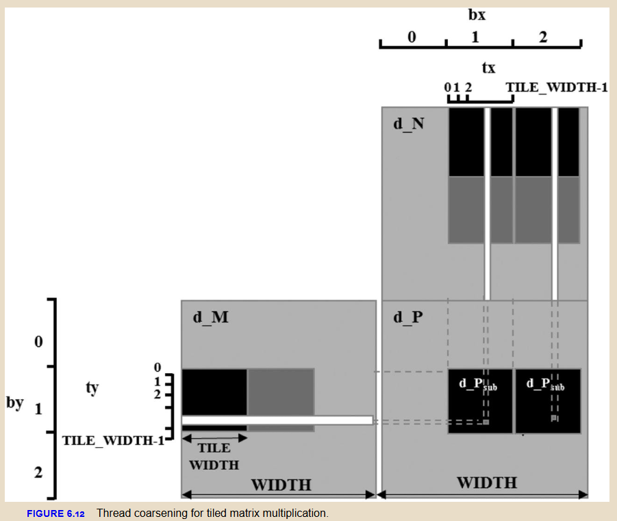
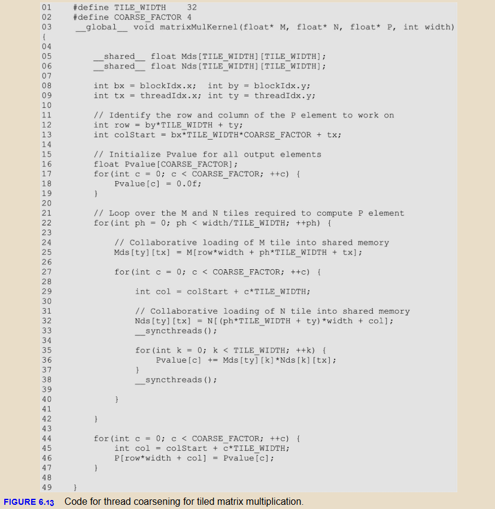

你好！欢迎来到 6.3 节。

如果说 **6.1 (Coalescing)** 和 **6.2 (Banking)** 是在教你怎么把数据**搬运**得更快（物流优化），那么 **6.3 线程粗化 (Thread Coarsening)** 就是在教你怎么让每个线程**干更多活**，从而减少搬运的次数（生产线优化）。

对于做 AI Compiler（如 Triton, TVM）或者高性能算子库（TensorRT, CUTLASS）的工程师来说，这一节的内容直接对应一个非常核心的编译器优化概念：**Register Tiling（寄存器分块）** 或 **Outer Loop Unrolling**。这是写出高性能 GEMM 的必经之路。

以下是 Section 6.3 的核心导读：

---

### 6.3 线程粗化 (Thread Coarsening) 导读

#### 1. 核心理念：从“一人搬一块砖”到“一人搬一车砖”

* **细粒度并行 (Fine-grained, 旧模式)**：
    * 这也是我们在 Chapter 2-5 中一直用的模式。
    * **做法**：每个线程只计算 **1 个** 输出元素。
    * **优点**：透明的可扩展性（Transparent Scalability）。如果 GPU 很大，所有线程并行跑；如果 GPU 很小，硬件自动把 Block 排队执行。逻辑简单。
    * **缺点**：**冗余开销 (Redundancy)**。为了计算这 1 个元素，可能需要把相关的数据从 Global Memory 搬到 Shared Memory 或 Register。如果隔壁线程也需要同样的数据，它也得去搬一次。这就是“并行的代价”。

* **线程粗化 (Thread Coarsening, 新模式)**：
    * **做法**：每个线程负责计算 **多个** 输出元素（比如 2个、4个、8个）。
    * **动机**：既然两个相邻的输出元素（比如矩阵的相邻两列）都需要读取相同的输入行（Matrix M），那不如让同一个线程把这两个活都干了。
    * **收益**：**复用数据**。数据读一次（到寄存器或 Shared Memory），被计算多次。极大地降低了 Global Memory 的带宽压力。

#### 2. 案例分析：矩阵乘法中的粗化
文中继续用矩阵乘法（Tiled Matrix Multiplication）举例，这非常经典。

* **场景**：计算输出矩阵 $P$ 的两个相邻 Tile（水平方向相邻）。
* **如果不粗化 (Chapter 5 的做法)**：
    * Block 1 计算 Tile A，Block 2 计算 Tile B。
    * Tile A 和 Tile B 位于同一行块，这意味着它们都需要加载 **矩阵 M 的同一部分**。
    * 结果：矩阵 M 的这部分被 Block 1 加载了一次，又被 Block 2 加载了一次。**双倍的 Global Memory 流量，浪费！**
* **如果粗化 (Coarsening)**：
    * 合并 Block 1 和 Block 2 的工作，用一个 Block 处理。
    * 让 Block 中的每个线程不再只算 1 个点，而是算 **一行里相邻的 2 个点**。
    * **操作流**：
        1.  Load 矩阵 M 的一个切片到 Shared Memory（只读一次）。
        2.  Load 矩阵 N 的 Tile 1 到寄存器 -> 计算第一个点。
        3.  Load 矩阵 N 的 Tile 2 到寄存器 -> 计算第二个点（**此时复用了 Shared Memory 里的 M**）。

#### 3. 代码实现细节 (Fig 6.13 解析)
这是实现高性能 Kernel 的雏形，请务必关注以下几点：

* **`COARSE_FACTOR`**：这是粗化因子。比如设置为 4，意味着一个线程要算 4 个输出元素。
* **寄存器数组 (`Pvalue`)**：
    * 代码：`float Pvalue[COARSE_FACTOR];`
    * **关键点**：这里不用 Shared Memory 存中间累加结果，而是直接用 **寄存器 (Registers)**。这是最快的存储。在编译器术语中，这叫 **Register Tiling**。
* **循环结构**：
    * 外层循环：遍历 M 的 Tile（和以前一样）。
    * 内层循环（新增）：`for (c = 0; c < COARSE_FACTOR; ++c)`。
    * 逻辑：对于每一个加载进来的 M 元素，我们去遍历 N 的不同列，更新 `Pvalue` 数组里的不同元素。

#### 4. 三大陷阱 (Pitfalls) —— 编译器工程师的必修课

作者非常诚恳地指出了三个“坑”，这在实际调优中经常遇到：

1.  **不要为了粗化而粗化 (Unnecessary Optimization)**
    * **原理**：粗化的核心目的是**减少冗余的数据读取**。
    * **反例**：向量加法 (Vector Add)。$C[i] = A[i] + B[i]$。每个数据只用一次，完全没有复用的机会。这时候做粗化，除了让代码变复杂，没有任何带宽收益。

2.  **不要导致硬件闲置 (Underutilization)**
    * **原理**：粗化意味着线程总数变少了（因为一个线程干了多个人的活，总 Block 数就少了）。
    * **风险**：如果你的任务本身规模就不大，粗化过度会导致 GPU 上只有几个 Block 在跑，剩下的 SM 全都在围观。这破坏了并行的初衷。

3.  **寄存器压力 (Resource Consumption / Occupancy) —— 最致命的坑**
    * **原理**：你让一个线程多干活，它就需要更多的寄存器来存状态（比如上面的 `Pvalue` 数组）。
    * **连锁反应**：
        * 线程用的寄存器变多 -> SM 能同时跑的 Warp 数量变少（Occupancy 降低）。
        * Occupancy 降低 -> 无法掩盖 Global Memory 延迟（回看 6.2 节）。
        * **结果**：本来想优化带宽，结果因为延迟掩盖不住，性能反而下降。
    * **编译器视角**：这也是为什么 nvcc 或者 Triton 编译器在做 Loop Unrolling 时非常谨慎，需要精细计算 Register Pressure。

---

### 💡 专家视角：这一节与现代 AI 编译器的联系

对于你（AI Compiler Developer）来说，这一节的内容可以映射到以下高级概念：

1.  **Register Tiling (寄存器分块)**：
    PMPP 讲的 Thread Coarsening，在 CUTLASS 或 Triton 的术语里，通常对应于 **Warp-level** 或 **Thread-level** 的 **M x N x K 拆分**。
    * Shared Memory Tile 解决了 Block 间的复用。
    * Register Tile (Coarsening) 解决了 Thread 内部的指令级复用。

2.  **ILP (Instruction Level Parallelism)**：
    粗化还有一个文中没细讲但在硬件上极大的好处：**指令级并行**。
    当一个线程展开循环，计算 `Pvalue[0] += ...`, `Pvalue[1] += ...` 时，这两条指令是独立的。现代 GPU 的指令流水线可以同时发射这两条指令，从而填满计算单元（FMA Units）。如果不粗化，线程内依赖太强，流水线可能会停顿。

3.  **Triton 语言的结构**：
    你之前问过 Triton。Triton 的 `tl.dot` 操作其实帮你自动处理了 Shared Memory Tiling。但是，当你写 Triton Kernel 时，选择 `BLOCK_SIZE_M`, `BLOCK_SIZE_N` 其实就是在隐式地调整 Thread Coarsening 的粒度。Triton 编译器后端会根据你设定的块大小，自动决定每个线程要在寄存器里拿多少数据。

**总结**：
Thread Coarsening 是从“纯并行思维”向“资源复用思维”的转变。它是压榨 GPU 峰值计算能力（TFLOPS）的关键技术，因为只有把数据存在寄存器里复用（而不是反复去 Shared/Global Memory 读），才能让计算单元（Tensor Core / CUDA Core）一直不饿着。

下一节（6.4）我们将讨论如果数据布局真的很烂（既不能 Coalescing 也没法简单复用）该怎么办？准备好迎接更复杂的挑战了吗？