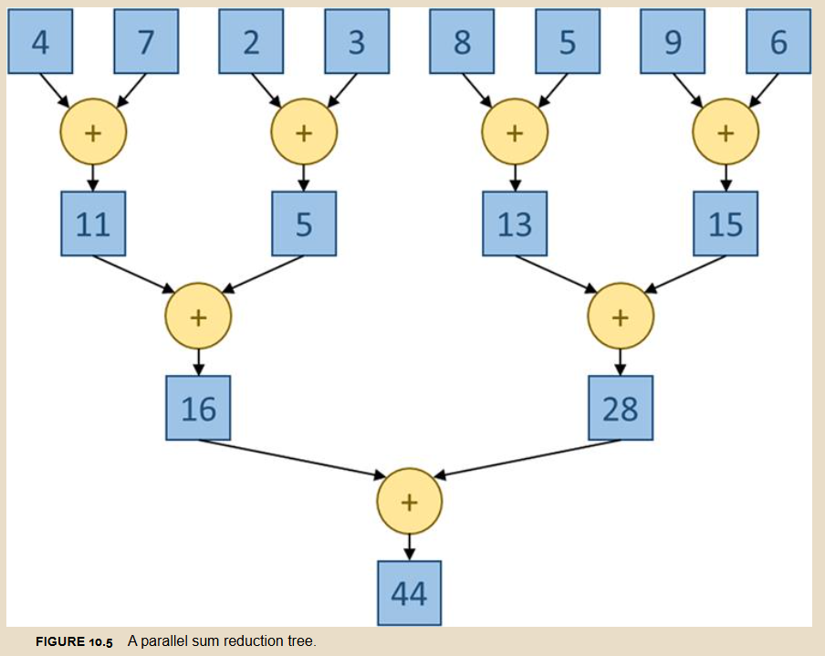
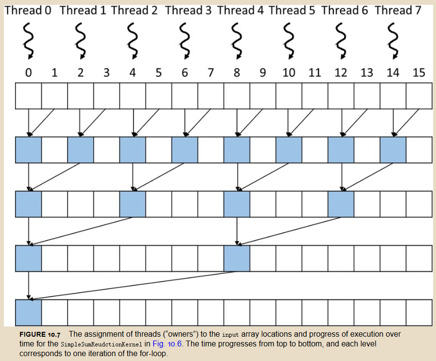
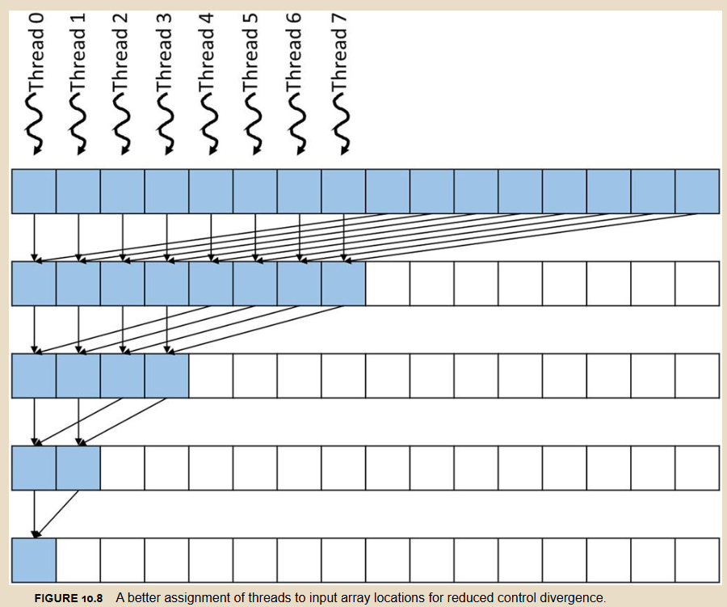
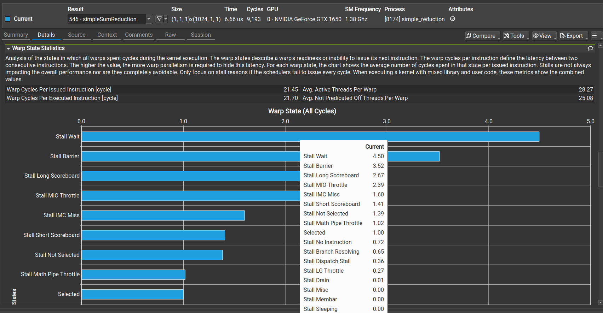
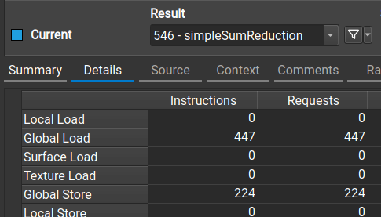
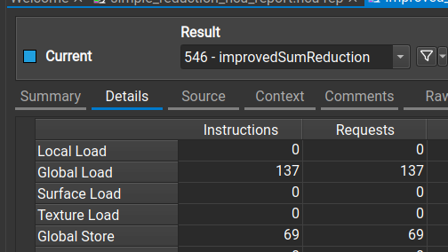

gpu上做规约需要利用多线程，做log2次操作，遍历左边的线程，每一个线程要加上右边的

但是如果 Warp 内有一个线程需要执行加法，另外 31 个不需要，那么这 31 个线程也必须占用硬件资源（虽然它们被 Mask 掉了不做实际计算）。原文给出了一个惊人的数据：对于 256 个元素的输入，这个算法只有 35% 的资源利用率。

我们采用一种新的顺序寻址 (Sequential Addressing) 策略，不再让步长 stride 从 1 开始翻倍，而是从 $N/2$ 开始减半。
这种方法将发散限制在了最后 5 个迭代步（当活跃线程 < 32 时），而不是贯穿整个过程。资源利用率从 35% 提升到了 66%！
我们可以对比一下ncu的结果，首先是warp的：

stall wait会少很多，另外一个是全局内存访问：

由于改进版线程 ID 是连续的，访问的地址也是连续的，就可以自动使用合并访问，访问次数就少很多。